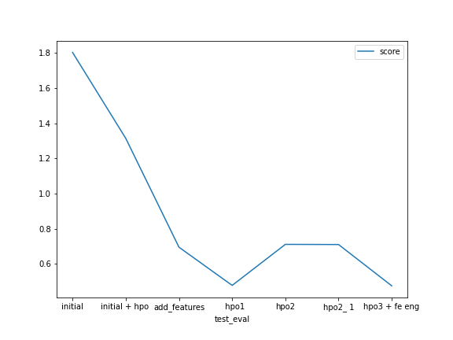

# autogluon-kaggle-bike-riding-regression
# Report: Predict Bike Sharing Demand with AutoGluon Solution
#### ALmamon rasool

## Initial Training
### What did you realize when you tried to submit your predictions? What changes were needed to the output of the predictor to submit your results?
we needed to get ride of the negtive values from the prediaction

### What was the top ranked model that performed?
hpo phase 3 with FE V2  where we convert hours to day part  as catgorical data
the final model called WeightedEnsemble_L3  

## Exploratory data analysis and feature creation
### What did the exploratory analysis find and how did you add additional features?
1. range of counts from 1 to 1000 
2. temp and a temp is very corrlated and drop one of them maybe can give better results
3. many features can be extracted from the datetime , and many features are catgorical

### How much better did your model preform after adding additional features and why do you think that is?
it did alot more better from 1.8 to 0.7 and that due to the task is very time depenint and  when we give the model more info about the time and event it be better

## Hyper parameter tuning
### How much better did your model preform after trying different hyper parameters?
it help a lot  exampel model from score of 0.6 after hpo it be 0.4
### If you were given more time with this dataset, where do you think you would spend more time?
more feature engineering , solve it  as timeseris problem

### Create a table with the models you ran, the hyperparameters modified, and the kaggle score.
|model|hpo1|hpo2|hpo3|score|
|--|--|--|--|--|
|initial|?|?|?|?|
|add_features|?|?|?|?|
|hpo|?|?|?|?|

### Create a line plot showing the top model score for the three (or more) training runs during the project.

 

### Create a line plot showing the top kaggle score for the three (or more) prediction submissions during the project.

 

## Summary

doing feature engineering  helps improve  score very much , also understanding data  lke we clip values for minmum of 1 ride instead of 0 it gives better results , helping gloun with define data types  make it  do better work , also hpo is very  importnent to push results .
more better results can be by doing extra feature adding like extract 
